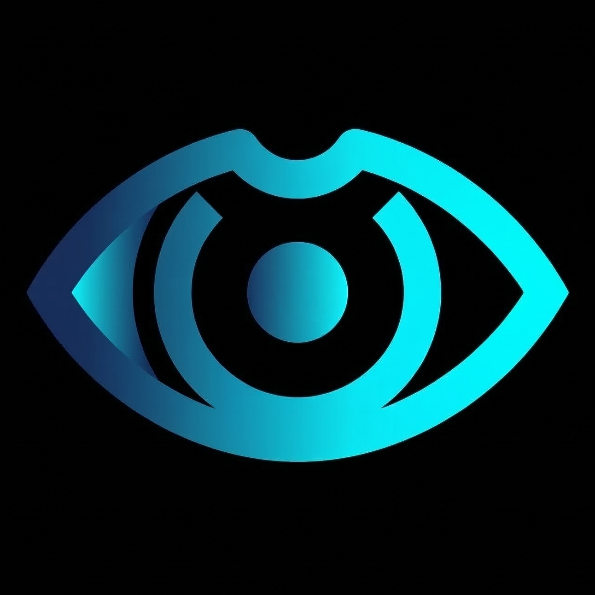

<p align="center">
  
</p>

<h1 align="center">Scowld</h1>

<p align="center">
  An open-source AI companion app for iOS with 3D anime avatars, hands-free voice chat, vision, terminal SSH, and persistent memory.
</p>

<p align="center">
  <a href="https://testflight.apple.com/join/7WgDe7e4"></a>
  <a href="https://github.com/apoorvdarshan/scowld"></a>
  <a href="LICENSE"></a>
</p>

<p align="center">
  
</p>

## Features

- **3D Anime Avatars** — 3 switchable VRM characters (Aria, Bella, Ciel) with lip sync, idle animations, and expressions. Each avatar has her own name and personality
- **Hands-Free Voice Chat** — Always-on speech recognition with auto-send on silence, live captions for both user and AI
- **6 STT Backends** — Native iOS, Groq Whisper, Deepgram, AssemblyAI, Google Cloud STT, OpenAI Whisper
- **Vision** — Front camera feeds to the AI so it can see what you see (no preview shown, privacy-first)
- **Terminal SSH** — Say "build me a website" and she SSHs into your Mac, opens Terminal with Claude Code, and builds it while you watch in real-time
- **Multi-Provider LLM** — Gemini, OpenAI, Claude, Ollama, OpenRouter, xAI, Together AI
- **Text-to-Speech** — ElevenLabs, OpenAI TTS, or native iOS
- **Persistent Memory** — AI extracts and remembers key details across conversations using memory slots

## Architecture

```
Native iOS (Swift/SwiftUI)
├── VoiceManager        — Always-on speech recognition + silence detection
├── CloudSTTManager     — Groq, Deepgram, AssemblyAI, Google Cloud STT support
├── MemoryStore         — CoreData persistence for chat history + memory logs
├── MemoryExtractor     — LLM-powered memory extraction from conversations
├── LLM Providers       — Gemini, OpenAI, Claude, Ollama, OpenRouter, xAI, Together
├── SSHManager          — Citadel-based SSH connection to Mac for terminal access
├── TerminalToolHandler — LLM [TERMINAL] block parsing, safety checks, Claude CLI dispatch
└── HomeView            — Main UI with WKWebView bridge

WKWebView (Amica Web Frontend (by Arbius AI))
├── Three.js + three-vrm — 3D avatar rendering
├── VRMA Animations      — Idle, gesture, and lip sync
├── AudioContext          — TTS audio playback
└── Native Bridge         — JS <-> Swift message passing
```

## Requirements

- iOS 17.0+
- Xcode 16+
- An API key for at least one LLM provider

## Setup

1. Clone the repo
   ```bash
   git clone https://github.com/apoorvdarshan/scowld.git
   cd scowld
   ```

2. Open in Xcode
   ```bash
   open Scowld.xcodeproj
   ```

3. Build and run on your iPhone

4. In Settings, select your AI provider and enter your API key (stored in iOS Keychain)

## How It Works

### Voice Mode
Tap the waveform icon to enable hands-free mode. Speak naturally — the app auto-sends after 1.2s of silence. While the AI responds, the mic pauses and resumes automatically after TTS finishes. Live captions show what you're saying and what the AI says.

### Avatars
Switch between Aria, Bella, and Ciel in Settings. Each avatar uses her own name by default. Set a custom name to override it.

### Vision
The front camera is enabled by default (hidden, no preview). The AI can see through your camera when you send messages. Toggle with the eye icon in the bottom bar.

### Memory
The AI automatically extracts important details from conversations and stores them in memory slots. These persist across sessions and are injected into the system prompt for context-aware responses.

### Terminal (SSH)
Enable SSH in Settings to let your companion run tasks on your Mac. Say things like "build me an ecommerce website" — she opens Terminal on your Mac with interactive Claude Code, and you watch it create files, write code, and build your project in real-time. When Claude finishes, she lets you know.

**Setup:** Settings → Terminal (SSH) → enter your Mac's IP, username, password → enable Remote Login on Mac (System Settings → General → Sharing → Remote Login).

## Tech Stack

- **Swift / SwiftUI** — Native iOS app
- **WKWebView** — Hosts [Amica](https://github.com/semperai/amica) (by Arbius AI) Three.js frontend for 3D avatar rendering
- **CoreData** — Chat history and memory persistence
- **Citadel** — Pure Swift SSH2 library for terminal access to Mac
- **Apple Speech** — On-device speech recognition
- **AVAudioEngine** — Audio session management for simultaneous TTS and STT

## Acknowledgments

- **[Amica](https://github.com/semperai/amica)** by Arbius AI — Open-source 3D avatar frontend with Three.js and VRM support (MIT License)

## License

MIT License — see [LICENSE](LICENSE)

## Contact

**Apoorv Darshan** — ad13dtu@gmail.com
