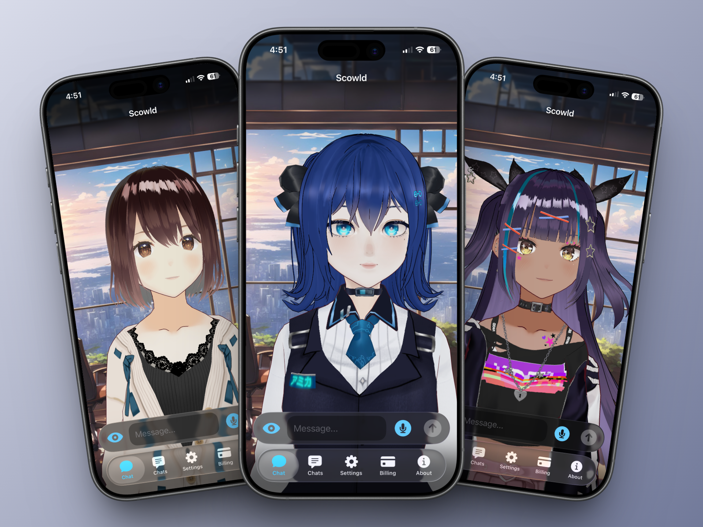

<p align="center">
  
</p>

<h1 align="center">Scowld</h1>

<p align="center">
  An AI companion app for iOS with 3D anime avatars, hands-free voice chat, vision, and persistent memory.
</p>

<p align="center">
  <a href="https://testflight.apple.com/join/7WgDe7e4"></a>
  <a href="https://github.com/apoorvdarshan/scowld"></a>
  <a href="LICENSE"></a>
</p>

<p align="center">
  
</p>

## Features

- **3D Anime Avatars** — 3 switchable VRM characters (Aria, Bella, Ciel) with lip sync, idle animations, and expressions. Each avatar has her own name and personality
- **Hands-Free Voice Chat** — Always-on speech recognition with auto-send on silence, live listening/transcribing states, and AI captions
- **Hosted Speech-to-Text** — Deepgram Nova routed through the Vercel backend
- **Vision** — Front camera feeds to the AI so it can see what you see (no preview shown, privacy-first)
- **Managed Gemini AI** — Gemini 3.1 Pro starts the response path with hosted fallback models
- **ElevenLabs Text-to-Speech** — Managed TTS with selectable voice IDs and local sample previews
- **Persistent Memory** — AI extracts and remembers key details across conversations using memory slots

## Repo Structure

This is a monorepo containing both the iOS app and the marketing website ([scowld.xyz](https://scowld.xyz)).

```
ios/             — iOS app (open ios/Scowld.xcodeproj in Xcode)
web/             — Next.js website (cd web && npm install && npm run dev)
```

## Architecture

```
Native iOS (Swift/SwiftUI)
├── VoiceManager        — Always-on speech recognition + silence detection
├── CloudSTTManager     — Hosted Deepgram speech-to-text support
├── MemoryStore         — CoreData persistence for chat history + memory logs
├── MemoryExtractor     — LLM-powered memory extraction from conversations
├── LLM Providers       — Hosted Gemini provider with model fallbacks
└── HomeView            — Main UI with WKWebView bridge

WKWebView (Amica Web Frontend (by Arbius AI))
├── Three.js + three-vrm — 3D avatar rendering
├── VRMA Animations      — Idle, gesture, and lip sync
├── AudioContext          — TTS audio playback
└── Native Bridge         — JS <-> Swift message passing
```

## Requirements

- iOS 17.0+
- Xcode 16+
- Vercel environment variables for Gemini, ElevenLabs, and Deepgram

## Planned Monetization

Voice usage is modeled as one simple unit: **1 voice credit = 1 full voice turn** (user speech, STT, Gemini response, and ElevenLabs TTS).

| Subscription | Price | Included credits |
| --- | ---: | ---: |
| Weekly | $9.99/week | 40 credits/week |
| Monthly | $34.99/month | 180 credits/month, refilled as 45/week |
| Yearly | $299.99/year | 2340 credits/year, refilled as 45/week |

| Extra credit pack | Price |
| ---: | ---: |
| 10 credits | $3.99 |
| 50 credits | $14.99 |
| 100 credits | $27.99 |
| 200 credits | $49.99 |
| 500 credits | $119.99 |

Extra credits can be used after the weekly subscription refill is consumed. They do not bypass safety limits such as one active voice reply at a time, capped audio input length, and capped TTS reply length.

## Setup

Clone the repo first:

```bash
git clone https://github.com/apoorvdarshan/scowld.git
cd scowld
```

### iOS App

1. Open in Xcode
   ```bash
   open ios/Scowld.xcodeproj
   ```
2. Build and run on your iPhone
3. In Settings, choose the ElevenLabs voice and character settings

### Website ([scowld.xyz](https://scowld.xyz))

```bash
cd web
npm install
npm run dev
```

Next.js dev server runs at http://localhost:3000.

### Hosted API Secrets

The iOS app does not embed provider API keys. Add these environment variables to Vercel for the `web/` deployment:

```bash
GEMINI_API_KEY
GEMINI_MODEL_FALLBACKS
ELEVENLABS_API_KEY
ELEVENLABS_DEFAULT_VOICE_ID
ELEVENLABS_MODEL
DEEPGRAM_API_KEY
DEEPGRAM_MODEL
```

See `web/.env.example` for defaults.

## How It Works

### Voice Mode
Tap the waveform icon to enable hands-free mode. Speak naturally — the app auto-sends after silence is detected. While the AI responds, the mic pauses and resumes automatically after TTS finishes.

### Avatars
Switch between Aria, Bella, and Ciel in Settings. Each avatar uses her own name by default. Set a custom name to override it.

### Vision
The front camera is enabled by default (hidden, no preview). The AI can see through your camera when you send messages. Toggle with the eye icon in the bottom bar.

### Memory
The AI automatically extracts important details from conversations and stores them in memory slots. These persist across sessions and are injected into the system prompt for context-aware responses.

## Tech Stack

**iOS app**
- **Swift / SwiftUI** — Native iOS app
- **WKWebView** — Hosts [Amica](https://github.com/semperai/amica) (by Arbius AI) Three.js frontend for 3D avatar rendering
- **CoreData** — Chat history and memory persistence
- **Deepgram** — Hosted speech-to-text
- **ElevenLabs** — Hosted text-to-speech
- **AVAudioEngine** — Audio session management for simultaneous TTS and STT

**Website**
- **Next.js** — React framework, deployed on Vercel
- **Vercel Route Handlers** — Server-side Gemini, ElevenLabs, and Deepgram API proxy routes
- **Vanilla CSS** — No Tailwind, no CSS-in-JS
- **Clash Display** — Font for all text, JetBrains Mono for monospace

## Acknowledgments

- **[Amica](https://github.com/semperai/amica)** by Arbius AI — Open-source 3D avatar frontend with Three.js and VRM support (MIT License)

## License

MIT License — see [LICENSE](LICENSE)

## Contact

**Apoorv Darshan** — ad13dtu@gmail.com
